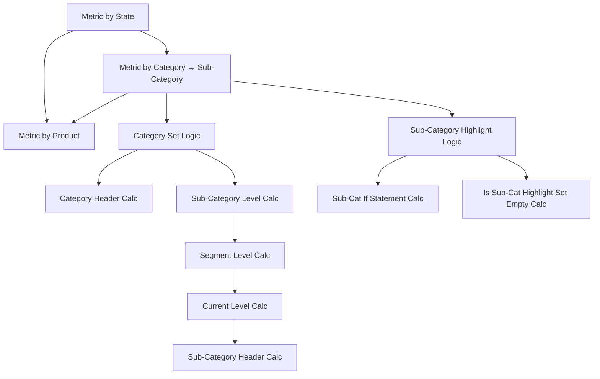

# Superstore Executive Overview  

### 📊 Purpose  
Executive-level view of sales performance across states, categories, sub-categories, and products.  

---

### 🔄 Interaction Flow  

1. **Click a State** → filters the **Metric by Category** bar chart  
2. **Click a Category** → reveals **Sub-Categories** in the same chart  
3. **Click a Sub-Category** → filters the **Metric by Product** bar chart  

---

### 📊 Metric by Category → Sub-Category Drilldown  

**Fields on Rows (left → right):**  

- `Category`  
- `1.2 Category Header`  
- `1.3 Sub-Category Level`  
- `1.7 Sub-Category Header`  
- `1.5 Segment Level`  

**Field on Color:**  

- `1.1 Category Set`

**Calculation Details**
// 1.2 Category Header
IF [1.1 Category Set] THEN [Category]
ELSE "•"
END

// 1.3 Sub-Category Level
IF [1.1 Category Set] THEN [Sub-Category]
ELSE [Category]
END

// 1.5 Segment Level
IF [1.1 Category Set] THEN [Sub-Category]
ELSE [Category]
END

// 1.6 Current Level
IF [1.5 Segment Level] = [Sub-Category] THEN 'Sub-Category'
ELSEIF [1.5 Segment Level] = [Category] THEN 'Category'
END

// 1.7 Sub-Category Header
IF [1.6 Current Level] = 'Sub-Category' THEN ""
ELSEIF [1.1 Category Set] THEN [Sub-Category]
ELSE ""
END

### 📊 Metric by Product Drilldown  

**Fields on Rows (left → right):**  

- `Category`  
- `Product Name`  
- `1.4 Sub-Category Level Set`  
- `Calc: Sub-Cat If Statement`  
- `Calc: Is the Sub-Cat Highlight Set Empty?`  

**Field on Color:**  

- `Calc: Is the Sub-Cat Highlight Set Empty?`  

**Calculation Details:**  
// Sub-Category Highlight
[1.1 Category Set] AND [1.4 Sub-Category Level Set]

// Sub-Cat If Statement
MAX(
  IF [Calc: Sub-Category Highlight] THEN [Sub-Category] END
)

// Is the Sub-Cat Highlight Set Empty?
{ SUM(
    IF [1.4 Sub-Category Level Set] THEN 1 ELSE 0 END
  )
} = 0

